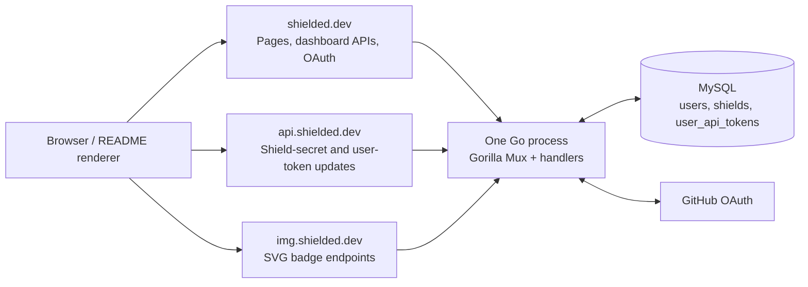
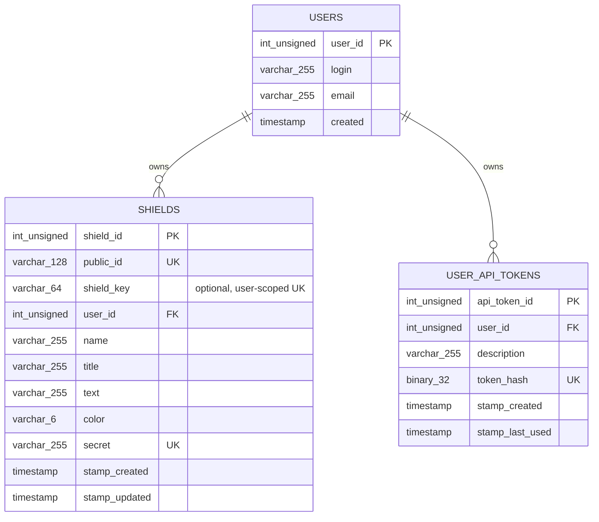
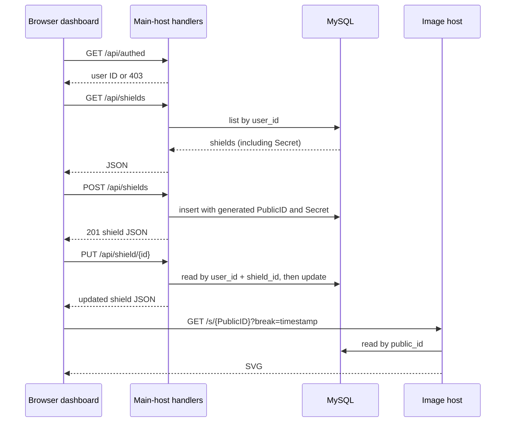

# Architecture

## Purpose

Shielded.dev hosts dynamic README badges ("shields"). A signed-in owner creates a shield in a dashboard, receives a stable public badge URL and a separate update secret, and can update the displayed badge values through the dashboard or the API. Badge consumers embed the public SVG URL in a README.

The repository builds one Go executable. The executable owns HTTP serving, OAuth, persistence, badge SVG rendering, pages, and production static assets; there is no separate API or image service process.

## System shape

Host names, rather than listening ports or services, separate the three external roles. `cmd/shielded/main.go` creates one Gorilla Mux router and mounts subrouters by `Host`.

## Runtime and configuration

`cmd/shielded/main.go` is the composition root.

1. Parses flags and configures structured text logging.
2. Opens MySQL using `-dsn` (default: `admin:password@tcp(127.0.0.1:3306)/shielded?parseTime=true`).
3. Constructs `UserMapper` and `ShieldMapper`.
4. Creates host-aware routers and all handlers.
5. Generates a new UUID-based HMAC key for `JwtAuth` for this process lifetime.
6. Starts either direct local HTTP or CertMagic-managed HTTPS.

Default production host values are compiled into `cmd/shielded/build.go`:

| Role | Host | Local-debug host |
| --- | --- | --- |
| Main site/dashboard | `shielded.dev` | `local.shielded.dev` |
| Programmatic update API | `api.shielded.dev` | `api.local.shielded.dev` |
| Public SVG badges | `img.shielded.dev` | `img.local.shielded.dev` |

`make debug` uses linker flags to substitute the local-debug values and starts on `:8686`. In normal mode (`-run-local=false`) CertMagic terminates HTTPS for all four names including `www.shielded.dev`; `www` redirects permanently to the root host. Static files are read from disk in local mode and from the embedded filesystem in normal builds.

For local HTTPS, `Caddyfile.local` accepts both the three canonical names and the three local-debug names. It reverse-proxies each request to `127.0.0.1:8686`, sets the upstream `Host` header to the local-debug name the Go router expects, and uses Caddy's internal CA. Its comments list the required `/etc/hosts` entries and startup order.

`run-local.sh` runs an isolated `mysql:8.4` container named `shieldeddotdev-local-mysql` on `127.0.0.1:3306`, with the default local DSN credentials and no data volume. It removes any prior instance before startup, waits for MySQL, applies every `schema/[0-9][0-9][0-9]_*.sql` file in lexical/numeric order, ensures the fixed debug user exists, then builds the debug-tag executable and runs Caddy. Its signal/exit trap terminates the Go process and force-removes the MySQL container; the next run is also a clean database.

## HTTP surface

### Main host: `shielded.dev`

| Route | Method(s) | Handler / behavior |
| --- | --- | --- |
| `/`, `/index.html` | GET, HEAD | Renders `pages.IndexPage`. |
| `/dashboard` | GET, HEAD | Renders `pages.DashboardPage`; the browser app redirects unauthenticated visitors after checking `/api/authed`. |
| `/privacy.html` | GET, HEAD | Renders `pages.PrivacyPage`. |
| `/github/login` | no method restriction | Starts GitHub OAuth in production; signs in the debug user in local mode. |
| `/github/callback` | no method restriction; production only | Validates OAuth state, exchanges the code, fetches the GitHub user, saves it, signs a JWT cookie, and redirects to the dashboard. |
| `/api/authed` | no method restriction | Returns the authenticated user ID as a JSON number, or `403`. |
| `/api/shields` | GET | Returns the current user's shields as JSON. |
| `/api/shields` | POST | Creates a new shield for the current user and returns it as JSON with `201 Created`. |
| `/api/shield/{id}` | PUT | Updates an existing shield only after looking it up by both authenticated owner ID and shield ID. |
| `/api/shield/{id}` | DELETE | Deletes an owned shield and returns `204 No Content`. |
| `/api/tokens` | GET | Returns the current user's API-token metadata. Plaintext token values and hashes are never returned. |
| `/api/tokens` | POST | Creates a user-level API token from a required description. Returns its metadata and plaintext token once with `201 Created`. |
| `/api/token/{id}` | DELETE | Revokes an owned user-level API token and returns `204 No Content`. |
| `/env` | no method restriction | Returns the configured root/API/image hosts as JSON for browser code. |
| all remaining paths | local: no method restriction; production: no method restriction | Serves the static asset filesystem. |

### Update API host: `api.shielded.dev`

| Route | Current handler behavior |
| --- | --- |
| `/` | `ApiHandler.HandlePOST` is mounted without a router method restriction. All clients use `Authorization: token <token>`. A non-empty form field `shield_key` selects a user-token request: it is required for `sdu_` tokens, while blank or absent values require a per-shield token. The endpoint accepts optional `title`, `text`, and `color`, normalizes/validates color, and returns `{"ShieldURL":"https://img-host/s/public-id","ShieldKey":"shield-key"}`. A user-token request scopes the shield key to the authenticated user; a missing shield is created with the dashboard defaults—name `New Shield`, title `New`, text `Shield`, and color `00AA55`—plus a generated per-shield token, then returns `201 Created`. Existing shields return `200 OK`. Invalid user tokens produce `401`; invalid shield keys and fields produce `400`. |

The endpoint is deliberately field-partial: omitted or empty form values leave the stored field unchanged. It does not update `Name`.

### Image host: `img.shielded.dev`

| Route | Behavior |
| --- | --- |
| `/s/{pid}` | Loads the shield by public ID (`[a-z0-9]{3,128}`) and renders an SVG with `go-badge`. It sets `Cache-Control: no-cache`, so a stable public URL reflects updates promptly. |
| `/s` | Renders an ephemeral SVG from query `title`, `text`, and `color`; default color is `green`. It validates/normalizes color and sends a 30-day cache policy. Nothing is persisted. |

Both endpoints return `image/svg+xml`. The public ID is the lookup key exposed in Markdown; the shield secret is the write credential and never appears in a badge URL.

## Authentication and authorization

Production login uses GitHub OAuth with scope `user:email`.

1. `/github/login` generates a UUID, puts it in the `gh-auth-state` cookie with a 15-minute expiry, and redirects to GitHub.
2. `/github/callback` compares the returned `state` to that cookie, exchanges `code` for an OAuth token, and fetches the authenticated GitHub profile.
3. `UserMapper.Save` inserts or updates the GitHub user ID, login, and email in MySQL.
4. `JwtAuth.Authorize` issues an HS256 JWT whose registered ID claim is the numeric GitHub user ID. It is stored in the `auth` cookie for 36 hours with `Secure` and `HttpOnly` flags.
5. Dashboard API handlers call `JwtAuth.GetAuth`; their data access is scoped by user ID, not just shield ID.

In local mode, `DebugAuthHandler` bypasses GitHub and signs in a fixed `{UserID: 1, Login: "debug"}` user. No database user row is written by that debug-login path.

The JWT HMAC key is a new random UUID every process start and is not loaded from configuration or persisted. Existing `auth` cookies become invalid after a restart; this is current behavior, not a durable session design.

## Persistence model

There are three code-owned mappers in `model/`. `schema/000_BASELINE.sql` is the dump-derived baseline schema for a fresh MariaDB/MySQL database. `schema/001_user_api_tokens.sql` adds user-level token storage, and `schema/002_shield_key.sql` adds an optional `shield_key`. Future schema changes belong in new, forward-only SQL files in `schema/`, numbered in application order. The application has no production migration runner; the local runner starts from a clean database and reapplies every migration.

`ShieldMapper.Save` inserts a shield when `ShieldID` is zero and otherwise updates it. Creation generates both IDs:

- `PublicID` starts at three characters from a lowercase, ambiguity-reduced alphabet. `PublicIDGenerator` serializes generation within a process and increases the generated length on a collision found in MySQL.
- `Secret` is generated by the dashboard handler as 40 characters from the same alphabet. It authenticates the programmatic update API.

The mapper uses transactions for shield inserts, updates, and deletes. Reads are direct `QueryRow`/`Query` calls. `UserMapper.Save` uses MySQL `INSERT ... ON DUPLICATE KEY UPDATE`. The baseline has primary keys on `users.user_id` and `shields.shield_id`, unique keys on `shields.public_id` and `shields.secret`, an index on `shields.user_id`, and a cascading foreign key from shields to users.

`shield_key` stores the optional `ShieldKey`. When set, it must be 5-64 lowercase letters, digits, or hyphens; the dashboard rejects duplicate keys and the `002` migration makes its `(user_id, shield_key)` pair unique. The API host receives it as a `shield_key` form field for user-token requests, without exposing the internal numeric `shield_id` or changing the per-shield token API.

`000_BASELINE.sql` contains `DROP TABLE IF EXISTS` before its table definitions and is suitable only for initializing or deliberately replacing a database. It is not a safe upgrade migration. Subsequent migrations must use the next numeric prefix (for example, `001_add_example.sql`) and must not be renamed, reordered, or changed after application.

### User-level API tokens

`user_api_tokens` holds multiple independently revocable tokens per user. Plaintext values start with `sdu_`; their full value, including the prefix, is hashed for storage. A token has a non-empty description, a database-generated `stamp_created` timestamp, and a nullable `stamp_last_used` timestamp; `null` means it has not been used. The `001` migration records actual point-in-time fields as MySQL `TIMESTAMP` columns.

The dashboard creates a 32-byte `crypto/rand` secret, encodes it as an `sdu_`-prefixed base64url token, and stores only its SHA-256 hash. The plaintext token is returned to the authenticated owner exactly once from `POST /api/tokens`; list responses expose only metadata. Deletion revokes a token by deleting its row. The API host receives it as `Authorization: token <token>` with a `shield_key` form field, hashes the supplied value, scopes the requested shield key to the token's user, and updates `stamp_last_used` immediately after valid token authentication.

## Request flows

### Dashboard creation and editing

The authenticated dashboard is a Preact SPA. The shield list and user-token list are component state, while each shield form owns its local draft state. A shield form listens for input events across its controls, cancels any pending save after every change, and schedules a dashboard `PUT` 500 ms after the most recent valid input. This preserves the mounted input and focus during editing. Creation and deletion update the corresponding list immediately through their API calls.

Each form exposes a badge preview, an optional shield key, a copyable Markdown URL, the copy/reveal-able update secret, and generated API examples. The preview adds a timestamp query value, although the public image handler itself ignores it; the browser uses it to bypass its image cache while editing.

The dashboard is a single-page application. Its `#/user` client-side view contains the API-token section; it requires a description at creation, displays the raw value once with a copy button, and lists each active token's description, created timestamp, last-used timestamp (or `Never`), and revoke action.

### External update and README rendering

1. An external client posts form fields to `https://api.shielded.dev/` with `Authorization: token <token>`. Per-shield values omit `shield_key` and update one shield; `sdu_` user-token values include `shield_key=<shield-key>` and can update or create a shield owned by that user.
2. `ApiHandler` uses a non-empty `shield_key` to select user-token handling, identifies the token from its `sdu_` prefix, finds it by SHA-256 hash, then finds the owned shield by `(user_id, shield_key)`. A user-token request creates the shield when that pair does not exist. Requests with a blank or absent `shield_key` find one shield by secret.
3. The handler validates its known form field names, records `stamp_last_used` immediately after valid user-token authentication, normalizes a supplied color, saves the row, and returns the stable public image URL.
4. A README renderer requests `https://img.shielded.dev/s/<public-id>`.
5. `ShieldHandler` loads the shield by `public_id` and writes an SVG using its title, text, and color.

Because badge content is rendered from the database on every public image request and sent with `Cache-Control: no-cache`, there is no separate cache invalidation or asynchronous rendering pipeline.

## Server-rendered pages and frontend

`pages/*.templ` define the pages and shared `Head`, header, footer, and static-badge components. The `templ` generator writes `pages/*_templ.go`, which the Go server renders via `templ.Handler`.

The static frontend has two entry functions exported from `ts/main.ts`:

- `Home` calls `/env` and mounts API usage examples on the home page.
- `Dashboard` checks `/api/authed`, retrieves `/env`, and mounts the authenticated Preact dashboard, including its `#/user` API-token view.

The authenticated frontend uses Preact with a small hash-based route switch and local component state; there is no separate state store library or server-side JSON API versioning. Browser requests use `XMLHttpRequest` in `ts/api/request.ts` with credentials enabled; JSON request bodies are sent by the dashboard handlers even though they do not explicitly set a `Content-Type` header.

Sass source in `scss/` produces `static/style/style.css`. TypeScript is compiled and bundled by Rollup into the ES module `static/main.js`. The pages load that module directly with inline `type="module"` imports.

## Build and delivery

The `Makefile` defines the build pipeline:

1. `go generate ./...` runs `go tool templ generate -path ../../pages` from the executable package.
2. Sass compiles `scss/` into `static/style/style.css`.
3. Rollup bundles `ts/main.ts` and dependencies into `static/main.js`.
4. `go build ./cmd/shielded` builds the executable and injects the build user, timestamp, git revision/tag, and dirty marker.

Normal builds use `static.go` to embed the entire `static/` directory into the executable. Builds with the `debug` tag use `staticdebug.go`, which instead points `StaticAssets` to the on-disk `static` directory.

`make release` (the `release` directory target) cross-builds Linux amd64, macOS amd64/arm64, and Windows amd64 binaries, then writes ZIP files under `dist/`. No CI workflow, container definition, deployment manifest, or database migration runner is present in this repository.

## Important current constraints

These are descriptions of behavior visible in the code, useful when planning changes:

- Automated coverage is currently limited to validation-focused Go tests, and there is no production migration runner. The committed baseline schema is `schema/000_BASELINE.sql`; `run-local.sh` reapplies every ordered migration to a clean local database, while deployment operations must apply them in production.
- The dashboard API serializes the full `Shield` struct, including the update `Secret`, to the owning authenticated browser.
- User-level API-token hashes are never sent to the browser; plaintext values are returned only by token creation and are not persisted by the browser state. `sdu_` user tokens can update or create a shield identified by form field `shield_key` and update their `last_used` timestamp.
- `DashboardShieldApiIndexHandler` and `DashboardShieldApiHandler` accept raw JSON fields without server-side color or content validation; the API-host handler and static badge route do validate colors.
- The programmatic update endpoint's route has no explicit HTTP-method constraint even though its handler is named `HandlePOST`.
- Public IDs use `math/rand` seeded with time. Per-shield update secrets and user-level API tokens use `crypto/rand`; user-token values are stored as SHA-256 hashes.
- The implementation does not set `SameSite` on the OAuth state or auth cookies, and the OAuth state cookie is not explicitly marked `HttpOnly` or `Secure`.

Treat changes to any of these behaviors as compatibility/security work: update the affected server handler, browser client, public documentation, and verification coverage together.
